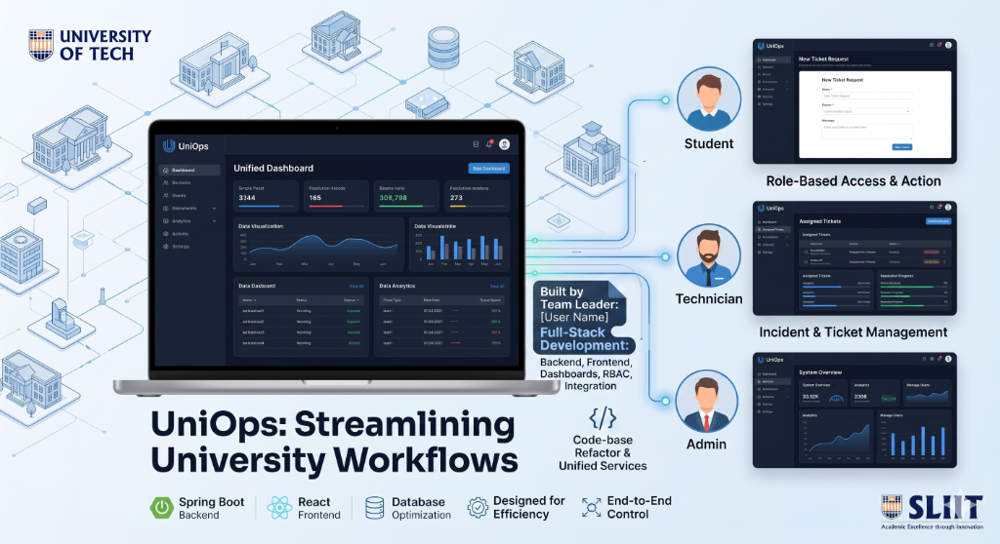

# UniOps

A university is modernizing its day-to-day operations. The university needs a single web platform to manage facility and asset bookings (rooms, labs, equipment) and maintenance/incident handling (fault reports, technician updates, resolutions). The platform supports clear workflows, role-based access, and strong auditability.

---

## Module C – Maintenance & Incident Ticketing

**Implemented by:** Irusha Dilshan

This module represents the complete backend API handling infrastructure and front-end interface dashboard managing Incident Ticket Workflows (raising reports, technician assignment, and comments tracking).

### 🛠 Tech Stack
- **Backend**: Java 21, Spring Boot 4.0.0, Spring Data JPA, Hibernate, Mockito, JUnit 5
- **Frontend**: React.js (Vite), TailwindCSS, Axios
- **Database**: MySQL Server

### 🔧 Backend Setup
- **Dependencies**: Ensure MySQL runs locally on port 3306. 
- **Database**: Requires `uniops_ticketing_db` database (tables are auto-created/updated via Hibernate property `update`).
- **Run Application**: Execute `./mvnw spring-boot:run` in terminal. The backend will operate on port **`8088`**.
- **API Documentation**: Interactive OpenAPI documentation is automatically served and browsable via [Swagger UI](http://localhost:8088/swagger-ui.html).

### 🔗 Service API Endpoints 

| HTTP Method | API Endpoint | Description |
|--------|----------|-------------|
| `POST` | `/api/v1/tickets` | Create a new maintenance ticket with max 3 multipart-file uploads. |
| `GET` | `/api/v1/tickets` | List tickets (Supports optional parameters `status` and `userId`). |
| `GET` | `/api/v1/tickets/{id}` | Gets full payload details of a requested ticket matching ID. |
| `PUT` | `/api/v1/tickets/{id}/status` | Updates ticket workflows (e.g. `IN_PROGRESS`, `REJECTED`, `RESOLVED`, `CLOSED`), enforcing resolution/rejection reasoning validation. |
| `PUT` | `/api/v1/tickets/{id}/assign` | Assigns an admin technician `technicianId` to a specific active ticket. |
| `GET` | `/api/v1/tickets/{id}/comments` | Retrieves chronological conversation thread logged beneath a ticket. |
| `POST` | `/api/v1/tickets/{id}/comments` | Appends a text comment to the thread linked to standard User IDs. | 
| `DELETE` | `/api/v1/tickets/{id}/comments/{commentId}` | Permanently deletes a comment mapping matching `requestingUserId` (Author mapping enforces `403 Forbidden`). |

### 🚀 Frontend Setup
1. Open the `/frontend` directory in the terminal (`cd frontend`).
2. Run `npm install` or `npm ci` to fetch package lock node_modules.
3. Start the Vite server locally using `npm run dev`. The React App runs natively on port **`5173`**.

> **Note**: An exported `UniOps_Ticketing_Postman_Collection.json` is packaged within the root workspace mapping all endpoint templates & responses for grading validators.
